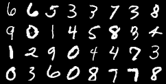

# VAE-Pytorch-implementation
使用Pytorch实现简单的变分自编码模型

选择main文件运行，数据集使用MINIST手写体数据集，运行数据保存在log文件夹。  
训练完成之后在pycharm打开终端输入"tensorboard --logdir=log"即可在浏览器查看保存的数据

真实图像  
  

step1生成图像   
  

step8生成图像  
  

  
step20生成图像  

